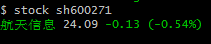
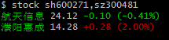
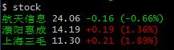

# stock

实时查看股票价格




## 终端
```vim
stock 股票代码（多个股票使用,号分割）

eg:stock  sh600271,sz300481
```
可以在同个目录下新建stock.list 文件，添加自选股，每行一个自选股

eg stock.list文件内容如下 </br>
sh600271 </br>
sz300481 </br>
sh600689

```vim
$ stock
```



## vim插件

```vim
function! Stockprice(symbol)
  execute system('stock -f vim ' . a:symbol)
endfunction

map <leader>htxx :call Stockprice('sh600271')<cr>
```
